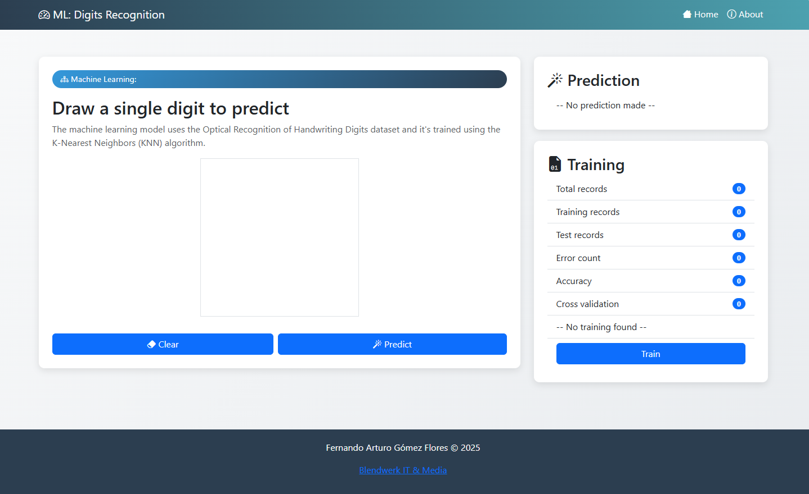
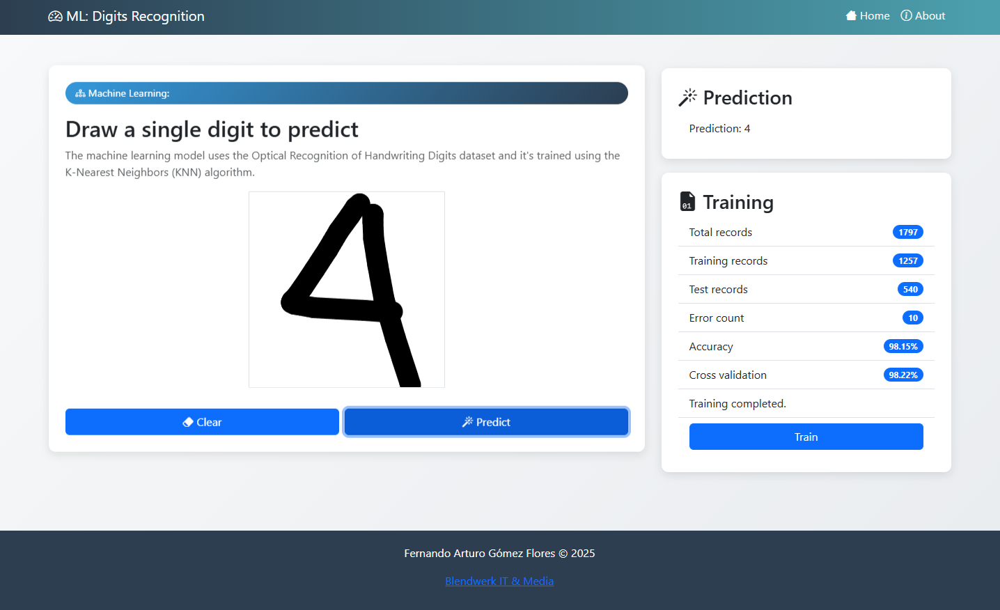
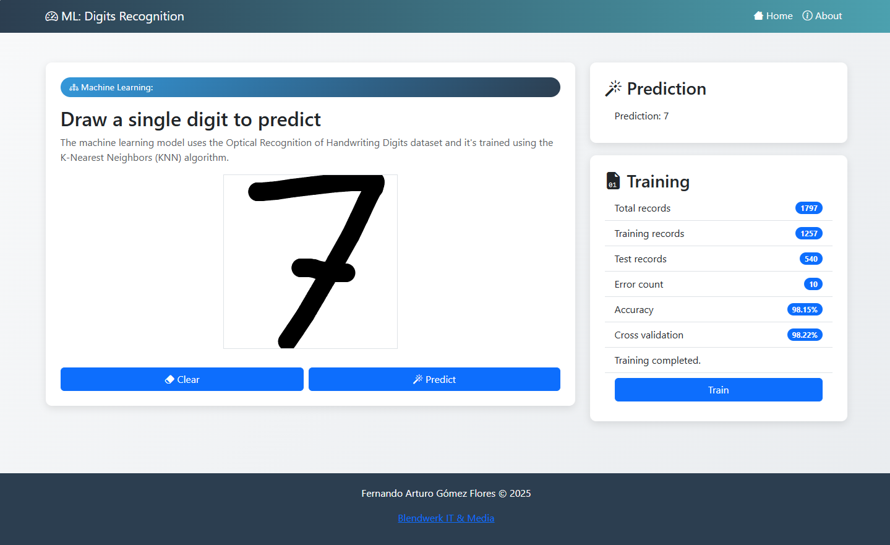
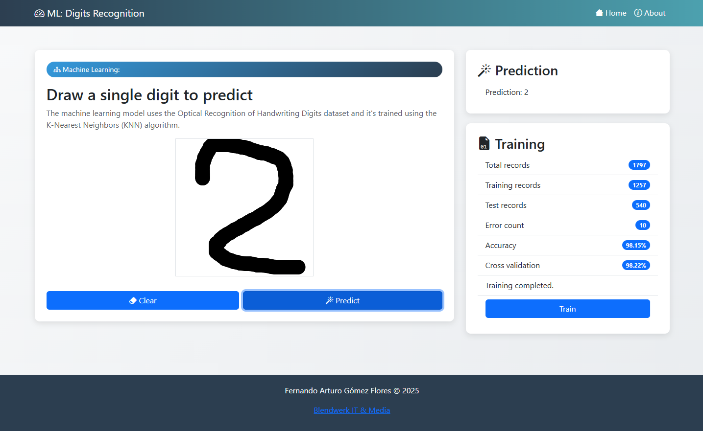

# Machine Learning: Digits Recognition

Small demo project that trains a K-Nearest Neighbors classifier on the scikit-learn `digits` dataset and exposes a tiny web UI to draw a digit and get a prediction. It includes utilities to save/load the trained model.




## Features
- Train a KNN classifier on the `digits` dataset (8x8 pixel images)
- Optional feature to specify certain parameters like `k_neighbors`, `test_size`, `random_seed`, `k_fold` for cross-validation
- Display training summary and metrics (accuracy, classification report, number of errors, etc.)
- Save/load trained model using `joblib`
- Simple Flask + canvas frontend where users can draw a digit that is downsampled to 8x8 and sent to the API

Some example predictions using the mouse to draw the number in the canvas:




## Quick start

1. Create and activate a virtual environment (Windows PowerShell):

```pwsh
python -m venv venv
.\venv\Scripts\Activate.ps1
```

2. Install dependencies:

```pwsh
pip install -r requirements.txt
```

If you don't have a `requirements.txt`, install the main libs:

```pwsh
pip install flask scikit-learn pandas numpy joblib tabulate colorama
```

Run the app (development):

```pwsh
python -m main
```

Open http://127.0.0.1:5000/ in your browser and draw a digit.

Project layout (important files)
- `src/main.py` — Flask app routes (index, /api/train, /api/predict)
- `src/domain/digits.py` — domain model (KNNModel), training, evaluation, predict and optional parameters + persistence
- `src/infrastructure/repositories.py` - allows saving/loading models (joblib)
- `src/application/commands.py` - application logic for training and prediction
- `src/templates/index.html` — frontend canvas and JS for downsampling to 8x8

## API
- POST /api/train — triggers training. Expects JSON payload with parameters (seed, test_size, k_neighbors, k_fold). For example: 
```json
{
  "seed": 42,
  "test_size": 0.3,
  "k_neighbors": 10,
  "k_fold": 5
}
```
Returns training summary and metrics. 
```json
{
  "success": true,
  "message": "Model trained successfully",
  "data": {
    "crossval_accuracy": 0.0,
    "datetime": "Wed, 17 Sep 2025 01:06:03 GMT",
    "error_count": 11,
    "feature_count": 64,
    "normal_accuracy": 0.9694444444444444,
    "test_records": 360,
    "total_records": 1797,
    "train_records": 1437,
    "confusion_matrix": [[...]]
  }
}
```
- POST /api/predict — accepts an object containing the pixels 8x8 for the image to classify:

```json
    { 
        "pixels": [64 numbers] 
    }
``` 
The values must be between 0..16. It then returns a json with the prediction:

```json
{ 
    "success": true, 
    "message": "Prediction successful",
    "data":  {
        "prediction": 7
    }
}
```
## Font-end
How the frontend preprocessing works
1. The canvas is a large drawing area (280x280) for usability.
2. Before sending, JS downsamples the canvas to an 8x8 offscreen canvas, reads RGBA pixels, converts to grayscale, inverts (because dataset values are high for dark pixels), and maps to 0..16.
3. The server accepts that 64-length list and your model's `predict()` handles either an 8x8 array or a flattened 64-length vector.

## Model persistence
- Use `joblib.dump` to save a dict with `{'model': <estimator>, 'params': <hyperparameters>, 'result': <previous results>}` and `joblib.load` to restore both for fast predictions in production.

## Troubleshooting
- If predictions are wrong or model performs poorly:
  - Try enabling scaling (StandardScaler) during training (not implemented yet).
  - Check that the frontend downsample/inversion mapping produces values similar to sklearn digits.
  - Validate saved model is loaded (check `knn_model.joblib` exists).
- If the web UI shows `Request failed`:
  - Check the Flask logs for stack traces.
  - Verify CORS if serving frontend and backend from different origins.

## Next steps
- Allow hyperparameter tuning from the UX
- Include scaling (StandardScaler) as an option during training
- Add model versioning (store metadata with joblib)
- Add unit tests 
- Improve UX: show the 8x8 preview and per-class probabilities


